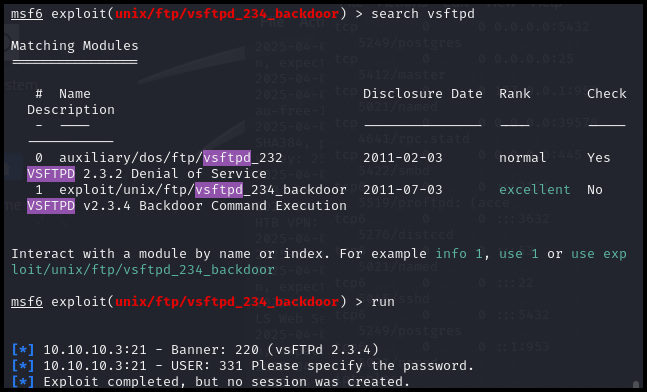
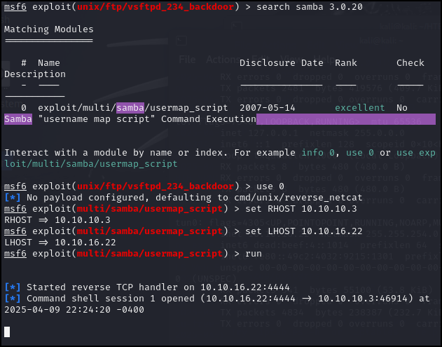
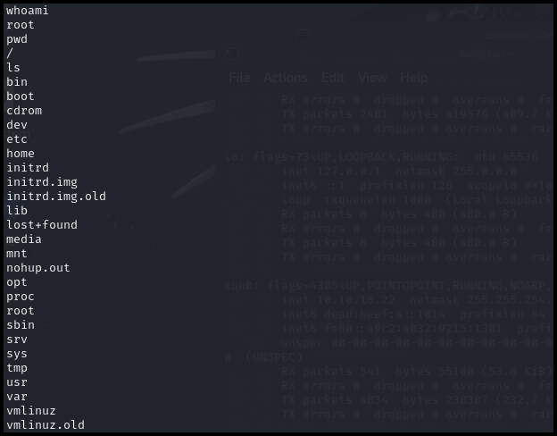

# HTB - Lame Write Up

## Enuemrate Open Ports
Run the following command to scan for open ports and services:

```
nmap -sV -sC <ipaddr>
```

Result:
```
Starting Nmap 7.94SVN ( https://nmap.org ) at 2025-04-09 20:20 EDT
Nmap scan report for 10.10.10.3
Host is up (0.18s latency).
Not shown: 996 filtered tcp ports (no-response)
PORT    STATE SERVICE     VERSION
21/tcp  open  ftp         vsftpd 2.3.4
|_ftp-anon: Anonymous FTP login allowed (FTP code 230)
| ftp-syst: 
|   STAT: 
| FTP server status:
|      Connected to 10.10.16.22
|      Logged in as ftp
|      TYPE: ASCII
|      No session bandwidth limit
|      Session timeout in seconds is 300
|      Control connection is plain text
|      Data connections will be plain text
|      vsFTPd 2.3.4 - secure, fast, stable
|_End of status
22/tcp  open  ssh         OpenSSH 4.7p1 Debian 8ubuntu1 (protocol 2.0)
| ssh-hostkey: 
|   1024 60:0f:cf:e1:c0:5f:6a:74:d6:90:24:fa:c4:d5:6c:cd (DSA)
|_  2048 56:56:24:0f:21:1d:de:a7:2b:ae:61:b1:24:3d:e8:f3 (RSA)
139/tcp open  netbios-ssn Samba smbd 3.X - 4.X (workgroup: WORKGROUP)
445/tcp open  netbios-ssn Samba smbd 3.0.20-Debian (workgroup: WORKGROUP)
Service Info: OSs: Unix, Linux; CPE: cpe:/o:linux:linux_kernel

Host script results:
|_clock-skew: mean: 2h00m29s, deviation: 2h49m45s, median: 26s
| smb-os-discovery: 
|   OS: Unix (Samba 3.0.20-Debian)
|   Computer name: lame
|   NetBIOS computer name: 
|   Domain name: hackthebox.gr
|   FQDN: lame.hackthebox.gr
|_  System time: 2025-04-09T20:22:00-04:00
| smb-security-mode: 
|   account_used: guest
|   authentication_level: user
|   challenge_response: supported
|_  message_signing: disabled (dangerous, but default)
|_smb2-time: Protocol negotiation failed (SMB2)

Service detection performed. Please report any incorrect results at https://nmap.org/submit/ .
Nmap done: 1 IP address (1 host up) scanned in 75.73 seconds
```

Service vulnerabilities:
* __vsftpd 2.3.4__ : [CVE-2011-2523](https://www.exploit-db.com/exploits/49757)
* __samba 3.0.20__ : [CVE-2007-2447](https://www.cvedetails.com/cve/CVE-2007-2447/)

__Exploration__: When testing each service for quest/anonymous access, nothing useful was found.

## Trying vulnerabilities with Metasploit
### vsftpd


Note:
1. Ensure the target host IP address is set.
2. Attempting the exploit failed as it shows that it requires a password to connect to the user.

### samba


Successfully opened a shell to the target!

## Getting User and Root Flags
Current user and position:


Flags position:
* User `makis` flag: `/home/makis/user.txt`
* Root flag: `/root/root.txt`

## Extended: Issue with vsftpd Exploit
Reference:
* Recommended write up for vsftpd issue:
* vsftpd exploit's POC: https://www.exploit-db.com/exploits/49757

Active Ports on Target Machine: `netstat -tnlp`
```
Active Internet connections (only servers)
Proto Recv-Q Send-Q Local Address           Foreign Address         State       PID/Program name
tcp        0      0 0.0.0.0:512             0.0.0.0:*               LISTEN      5444/xinetd     
tcp        0      0 0.0.0.0:513             0.0.0.0:*               LISTEN      5444/xinetd     
tcp        0      0 0.0.0.0:2049            0.0.0.0:*               LISTEN      -               
tcp        0      0 0.0.0.0:514             0.0.0.0:*               LISTEN      5444/xinetd     
tcp        0      0 0.0.0.0:49704           0.0.0.0:*               LISTEN      5344/rpc.mountd 
tcp        0      0 0.0.0.0:37672           0.0.0.0:*               LISTEN      -               
tcp        0      0 0.0.0.0:8009            0.0.0.0:*               LISTEN      5581/jsvc       
tcp        0      0 0.0.0.0:6697            0.0.0.0:*               LISTEN      5638/unrealircd 
tcp        0      0 0.0.0.0:3306            0.0.0.0:*               LISTEN      5168/mysqld     
tcp        0      0 0.0.0.0:1099            0.0.0.0:*               LISTEN      5622/rmiregistry
tcp        0      0 0.0.0.0:6667            0.0.0.0:*               LISTEN      5638/unrealircd 
tcp        0      0 0.0.0.0:139             0.0.0.0:*               LISTEN      5422/smbd       
tcp        0      0 0.0.0.0:5900            0.0.0.0:*               LISTEN      5643/Xtightvnc  
tcp        0      0 0.0.0.0:50095           0.0.0.0:*               LISTEN      5622/rmiregistry
tcp        0      0 0.0.0.0:111             0.0.0.0:*               LISTEN      4623/portmap    
tcp        0      0 0.0.0.0:6000            0.0.0.0:*               LISTEN      5643/Xtightvnc  
tcp        0      0 0.0.0.0:80              0.0.0.0:*               LISTEN      5601/apache2    
tcp        0      0 0.0.0.0:8787            0.0.0.0:*               LISTEN      5626/ruby       
tcp        0      0 0.0.0.0:8180            0.0.0.0:*               LISTEN      5581/jsvc       
tcp        0      0 0.0.0.0:1524            0.0.0.0:*               LISTEN      5444/xinetd     
tcp        0      0 0.0.0.0:21              0.0.0.0:*               LISTEN      5444/xinetd     
tcp        0      0 10.10.10.3:53           0.0.0.0:*               LISTEN      5021/named      
tcp        0      0 127.0.0.1:53            0.0.0.0:*               LISTEN      5021/named      
tcp        0      0 0.0.0.0:23              0.0.0.0:*               LISTEN      5444/xinetd     
tcp        0      0 0.0.0.0:5432            0.0.0.0:*               LISTEN      5249/postgres   
tcp        0      0 0.0.0.0:25              0.0.0.0:*               LISTEN      5412/master     
tcp        0      0 127.0.0.1:953           0.0.0.0:*               LISTEN      5021/named      
tcp        0      0 0.0.0.0:39578           0.0.0.0:*               LISTEN      4641/rpc.statd  
tcp        0      0 0.0.0.0:445             0.0.0.0:*               LISTEN      5422/smbd       
tcp6       0      0 :::2121                 :::*                    LISTEN      5519/proftpd: (acce
tcp6       0      0 :::3632                 :::*                    LISTEN      5276/distccd    
tcp6       0      0 :::53                   :::*                    LISTEN      5021/named      
tcp6       0      0 :::22                   :::*                    LISTEN      5045/sshd       
tcp6       0      0 :::5432                 :::*                    LISTEN      5249/postgres   
tcp6       0      0 ::1:953                 :::*                    LISTEN      5021/named  
```
There are a lot of active ports but we can only see 4 when we do initial enumeration from our local machine.

Existing Firewall Rules: `iptables -L -n`
```
Chain INPUT (policy DROP)
target     prot opt source               destination         
ufw-before-input  all  --  0.0.0.0/0            0.0.0.0/0           
ufw-after-input  all  --  0.0.0.0/0            0.0.0.0/0           

Chain FORWARD (policy DROP)
target     prot opt source               destination         
ufw-before-forward  all  --  0.0.0.0/0            0.0.0.0/0           
ufw-after-forward  all  --  0.0.0.0/0            0.0.0.0/0           

Chain OUTPUT (policy ACCEPT)
target     prot opt source               destination         
ufw-before-output  all  --  0.0.0.0/0            0.0.0.0/0           
ufw-after-output  all  --  0.0.0.0/0            0.0.0.0/0           

Chain ufw-after-forward (1 references)
target     prot opt source               destination         
LOG        all  --  0.0.0.0/0            0.0.0.0/0           limit: avg 3/min burst 10 LOG flags 0 level 4 prefix `[UFW BLOCK FORWARD]: ' 
RETURN     all  --  0.0.0.0/0            0.0.0.0/0           

Chain ufw-after-input (1 references)
target     prot opt source               destination         
RETURN     udp  --  0.0.0.0/0            0.0.0.0/0           udp dpt:137 
RETURN     udp  --  0.0.0.0/0            0.0.0.0/0           udp dpt:138 
RETURN     tcp  --  0.0.0.0/0            0.0.0.0/0           tcp dpt:139 
RETURN     tcp  --  0.0.0.0/0            0.0.0.0/0           tcp dpt:445 
RETURN     udp  --  0.0.0.0/0            0.0.0.0/0           udp dpt:67 
RETURN     udp  --  0.0.0.0/0            0.0.0.0/0           udp dpt:68 
LOG        all  --  0.0.0.0/0            0.0.0.0/0           limit: avg 3/min burst 10 LOG flags 0 level 4 prefix `[UFW BLOCK INPUT]: ' 
RETURN     all  --  0.0.0.0/0            0.0.0.0/0           

Chain ufw-after-output (1 references)
target     prot opt source               destination         
RETURN     all  --  0.0.0.0/0            0.0.0.0/0           

Chain ufw-before-forward (1 references)
target     prot opt source               destination         
ufw-user-forward  all  --  0.0.0.0/0            0.0.0.0/0           
RETURN     all  --  0.0.0.0/0            0.0.0.0/0           

Chain ufw-before-input (1 references)
target     prot opt source               destination         
ACCEPT     all  --  0.0.0.0/0            0.0.0.0/0           
ACCEPT     all  --  0.0.0.0/0            0.0.0.0/0           ctstate RELATED,ESTABLISHED 
DROP       all  --  0.0.0.0/0            0.0.0.0/0           ctstate INVALID 
ACCEPT     icmp --  0.0.0.0/0            0.0.0.0/0           icmp type 3 
ACCEPT     icmp --  0.0.0.0/0            0.0.0.0/0           icmp type 4 
ACCEPT     icmp --  0.0.0.0/0            0.0.0.0/0           icmp type 11 
ACCEPT     icmp --  0.0.0.0/0            0.0.0.0/0           icmp type 12 
ACCEPT     icmp --  0.0.0.0/0            0.0.0.0/0           icmp type 8 
ACCEPT     udp  --  0.0.0.0/0            0.0.0.0/0           udp spt:67 dpt:68 
ufw-not-local  all  --  0.0.0.0/0            0.0.0.0/0           
ACCEPT     all  --  224.0.0.0/4          0.0.0.0/0           
ACCEPT     all  --  0.0.0.0/0            224.0.0.0/4         
ufw-user-input  all  --  0.0.0.0/0            0.0.0.0/0           
RETURN     all  --  0.0.0.0/0            0.0.0.0/0           

Chain ufw-before-output (1 references)
target     prot opt source               destination         
ACCEPT     all  --  0.0.0.0/0            0.0.0.0/0           
ACCEPT     tcp  --  0.0.0.0/0            0.0.0.0/0           state NEW,RELATED,ESTABLISHED 
ACCEPT     udp  --  0.0.0.0/0            0.0.0.0/0           state NEW,RELATED,ESTABLISHED 
ufw-user-output  all  --  0.0.0.0/0            0.0.0.0/0           
RETURN     all  --  0.0.0.0/0            0.0.0.0/0           

Chain ufw-not-local (1 references)
target     prot opt source               destination         
RETURN     all  --  0.0.0.0/0            0.0.0.0/0           ADDRTYPE match dst-type LOCAL 
RETURN     all  --  0.0.0.0/0            0.0.0.0/0           ADDRTYPE match dst-type MULTICAST 
RETURN     all  --  0.0.0.0/0            0.0.0.0/0           ADDRTYPE match dst-type BROADCAST 
LOG        all  --  0.0.0.0/0            0.0.0.0/0           limit: avg 3/min burst 10 LOG flags 0 level 4 prefix `[UFW BLOCK NOT-TO-ME]: ' 
DROP       all  --  0.0.0.0/0            0.0.0.0/0           

Chain ufw-user-forward (1 references)
target     prot opt source               destination         
RETURN     all  --  0.0.0.0/0            0.0.0.0/0           

Chain ufw-user-input (1 references)
target     prot opt source               destination         
ACCEPT     tcp  --  0.0.0.0/0            0.0.0.0/0           tcp dpt:22 
ACCEPT     udp  --  0.0.0.0/0            0.0.0.0/0           udp dpt:22 
ACCEPT     tcp  --  0.0.0.0/0            0.0.0.0/0           tcp dpt:21 
ACCEPT     tcp  --  0.0.0.0/0            0.0.0.0/0           tcp dpt:3632 
ACCEPT     udp  --  0.0.0.0/0            0.0.0.0/0           udp dpt:3632 
ACCEPT     tcp  --  0.0.0.0/0            0.0.0.0/0           tcp dpt:139 
ACCEPT     udp  --  0.0.0.0/0            0.0.0.0/0           udp dpt:139 
ACCEPT     tcp  --  0.0.0.0/0            0.0.0.0/0           tcp dpt:445 
ACCEPT     udp  --  0.0.0.0/0            0.0.0.0/0           udp dpt:445 
RETURN     all  --  0.0.0.0/0            0.0.0.0/0           

Chain ufw-user-output (1 references)
target     prot opt source               destination         
RETURN     all  --  0.0.0.0/0            0.0.0.0/0
```
